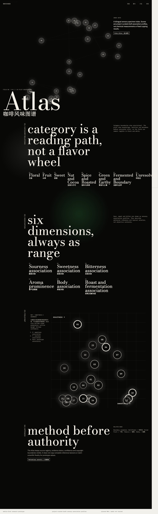
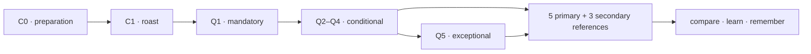
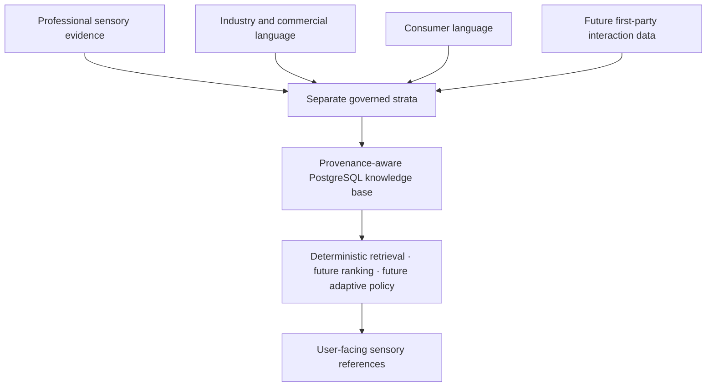
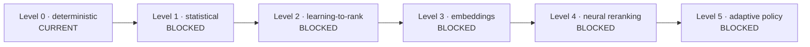

# Coffee Flavor Atlas

> An evidence-grounded mobile-first web prototype for translating everyday
> coffee perception into professional sensory references.

> 一个通过低负担自适应问答，将普通咖啡饮用者的感知转化为专业风味参考的证据驱动型移动网页原型。

**User Research · PostgreSQL Knowledge Base · Sensory Corpus · ML/DL Readiness**

**Current phase:** IMPLEMENTED portfolio and repository normalization ·
**PWA:** PLANNED · **ML status:** NOT_TRAINED

Coffee Flavor Atlas is for people who can tell that two coffees taste
different but do not always have words for the difference. The product concept
uses preparation and roast context, then a short sequence of sensory questions,
to offer a small set of perception-compatible references. It is a vocabulary
and comparison aid—not a tasting exam, a flavor wheel clone, or a system that
claims to detect a coffee's one true flavor.



[Read the recruiter overview](./PORTFOLIO.md) ·
[Open the long-form case study](./docs/portfolio/CASE_STUDY.md) ·
[See current evidence-backed status](./PROJECT_STATUS.md)

## The problem

Ordinary coffee drinkers often notice acidity, sweetness, bitterness, aroma,
or a familiar association without knowing the professional term that might
help them describe it. Package notes can add another difficulty: they may be
specific, unfamiliar, or interpreted as promises. Full professional cupping
forms introduce more vocabulary and precision than a casual tasting moment can
comfortably support.

The project asks a deliberately narrower question: can a low-burden
interaction help someone move from a broad impression toward more specific,
understandable sensory references while preserving uncertainty and the option
to reject every suggestion? That framing places the human experience first.
The database, professional corpus work, and future model program exist to make
the references traceable and useful.

## The product experience

The product contract begins with preparation context (C0) and roast context
(C1). It then asks one mandatory sensory question, continues only while another
answer may be useful, and reserves a fifth question for exceptional cases. The
intended result is five primary and three secondary references for comparison
and learning. <!-- claim: PRODUCT_INTERACTION_CONTRACT -->



The interaction is designed to treat context as a soft prior. A user's sensory
answers can override it. Candidate sets must support “none of these,” explicit
uncertainty, and unresolved outcomes. The current frontend demonstrates the
atlas, vocabulary, comparison, and methodology surfaces; the adaptive policy
and model-ranked result flow are designed but not trained or validated.

## What makes the project different

The public story is not “more data means a better AI.” It is the disciplined
separation of claims that look similar but mean different things:

- professional sensory evidence can support governed descriptor grounding;
- producer, competitor, roaster, and commercial language helps study industry
  variation but is not automatically professional truth;
- consumer language is valuable for familiarity, ambiguity, expectation, and
  question wording, but cannot silently become a professional label; and
- future first-party interviews and interaction events would be behavioral and
  product-evaluation signals, not objective flavor truth.

Those tracks remain separate in provenance, rights, review, and intended use.
The system also distinguishes source files from publication rows, effective
coffee records, descriptor assertions, human review, and model eligibility.
That separation prevents a visually impressive acquisition total from being
misrepresented as a training set.

## Current status

The mobile-first React interface and PostgreSQL knowledge-base foundation are
implemented and reproducibly tested. The repository contains 60 forward
migrations. <!-- claim: DATABASE_MIGRATIONS --> The frozen knowledge inventory
contains 130 canonical concepts, of which 92 are active sensory attributes.

<!-- claim: DATABASE_CANONICAL_CONCEPTS --> <!-- claim: DATABASE_ACTIVE_SENSORY -->

The acquisition census records 848 artifacts and 26,515 staged publication
rows. <!-- claim: ACQUISITION_ARTIFACTS --> <!-- claim: ACQUISITION_STAGED_ROWS -->
These are acquisition-scale measures, not professional labels. The current
hash-only descriptor pilot admits 140 assertions, de-inflates them to 139
assertion observations and 137 record-level unique observations.

<!-- claim: PILOT_ADMITTED_ASSERTIONS --> <!-- claim: PILOT_DEINFLATED_ASSERTIONS -->
<!-- claim: PILOT_RECORD_UNIQUE --> It records 508 within-record descriptor pair

events. <!-- claim: PILOT_PAIR_EVENTS -->

The current reviewed professional, human-confirmed, and rights-cleared
model-eligible totals are all zero. <!-- claim: REVIEWED_PROFESSIONAL_ASSERTIONS -->

<!-- claim: HUMAN_CONFIRMED_ASSERTIONS --> <!-- claim: MODEL_ELIGIBLE_ASSERTIONS -->

No interviews or usability sessions were conducted in this normalization pass,
and no model was run. <!-- claim: USER_INTERVIEW_COUNT -->

<!-- claim: USER_USABILITY_COUNT --> <!-- claim: MODEL_RUN_COUNT -->

The application is responsive and supports keyboard and reduced-motion
behavior. It does not currently include a web app manifest, installable icons,
a service worker, or an offline app shell. Publicly, it is therefore described
as a **mobile-first web prototype** and a **planned PWA**, not an implemented
installable PWA.

## Research journey

The project began with a bilingual sensory vocabulary and an exploratory
interface, then developed a PostgreSQL system of record for concepts,
observations, sources, rights, context, calibration, model experiments, and
audit evidence. Later rounds added deterministic retrieval, preparation and
roast context, adaptive-question semantics, reproducible pilot protocols, and
professional-competition source governance.

The most useful results include negative ones. A consumer-heavy acquisition
route was invalid for the professional-label goal. Competition result archives
contained large populations, but scores, rankings, repeated publication layers,
and sparse descriptor fields did not create a comparably large professional
sensory corpus. Round 3L made that anti-inflation result measurable. Round 3M
changed the unit of readiness from coffee rows to governed descriptor
assertions and bound any human-review claim to qualification, admission, and
row-level decision evidence.

The lesson is methodological: when the observation grain or evidence origin is
wrong, adding more rows amplifies error. The system was redesigned instead of
relabelling weak data. See the
[project timeline](./docs/portfolio/PROJECT_TIMELINE.md),
[iteration story](./docs/portfolio/RESEARCH_ITERATION_STORY.md), and
[Round 3M audit](./docs/audits/coffee-sensory-kb-v0-round3m/00_EXECUTIVE_RECEIPT.md).

## Data and evidence architecture



PostgreSQL preserves canonical knowledge separately from observations and
model output. Source version, file hash, locator, publication layer, evidence
tier, rights dimensions, duplicate lineage, preparation service, roast
evidence, review receipt, and gate eligibility are modeled rather than implied.
Effective-record construction prevents the same coffee, mirror, score sheet,
or repeated service from quietly increasing the usable count.

The browser-facing prototype still uses a small, schema-validated TypeScript
descriptor set to test the interface. It does not expose the restricted corpus
or private reviewer material, and it is not presented as a live view of the
PostgreSQL research database. Read the
[architecture guide](./docs/ARCHITECTURE.md), [database guide](./db/README.md),
and [documentation index](./docs/INDEX.md).

## User research and feedback mining

User research is currently at protocol-design status. The intended participants
are curious café customers, home brewers, beginners in specialty coffee, and
people comparing their own perception with a bean card or menu. Professional
cuppers are not the primary target.

The research program separates external consumer-language analysis,
interviews/usability observations, and first-party interaction events. Each has
different permissions and meanings. The repository defines research questions,
an interview and usability guide, metrics, consent and retention requirements,
a future event model, and an insight traceability template. It intentionally
contains no fabricated participants, quotes, or findings.

Start with the [user-research overview](./docs/user-research/USER_RESEARCH_OVERVIEW.md)
and [feedback-mining contract](./docs/user-research/USER_FEEDBACK_MINING_CONTRACT.md).

## PostgreSQL knowledge base

The database is the principal technical foundation. Its schemas distinguish
controlled reference values, canonical knowledge, evidence and rights, corpus
observations, preparation/roast context, calibration protocols, future model
runs, and audit decisions. Forward-only migrations, fail-closed constraints,
expected-state manifests, and disposable-database tests make changes
reproducible.

Human review is not inferred from a reviewer name or arbitrary hash. Current
governance requires acquired qualification evidence, scope-specific admission,
and row-level decision evidence. Historical rows remain append-only for ordinary
operations; current views select governed successors. Public availability and
human review remain independent from model-use or redistribution permission.

## ML/DL readiness

`MODEL_STATUS=NOT_TRAINED`. The project defines distinct future tasks for
professional descriptor normalization, sensory candidate ranking, association
estimation, adaptive question selection and stopping, and consumer-language
mapping. Each task has a proposed unit, label source, rights requirement,
split unit, leakage risks, metrics, and abstention behavior.



Deterministic exact/variant/trigram retrieval is the baseline to beat. More
complex methods require reviewed labels, source-family and coffee-level grouped
splits, model-use rights, calibrated evaluation, and measurable incremental
value. Deep learning must earn its cost and opacity; it is not included merely
to add an AI label. See the
[ML problem definition](./docs/ml/ML_PROBLEM_DEFINITION.md) and
[readiness matrix](./docs/ml/ML_DATA_READINESS_MATRIX.md).

## Demo and local setup

Requirements are Node.js/npm for the interface and PostgreSQL 17 for database
verification. The frontend is static and runs without a database connection.

```bash
npm ci
npm run dev
npm run public:verify
npm run ci:verify:web
```

For database work, use only a disposable database and follow
[`db/README.md`](./db/README.md):

```bash
npm run db:migrate
npm run test:db
npm run test:db:repro
npm run ci:verify
```

The [demo script](./docs/portfolio/DEMO_SCRIPT.md) distinguishes what the UI
does today from what future research and models may add.

## Documentation map

- Portfolio: [entry point](./PORTFOLIO.md),
  [case study](./docs/portfolio/CASE_STUDY.md), and
  [recruiter paths](./docs/portfolio/RECRUITER_READING_PATH.md)
- Current truth: [generated status](./PROJECT_STATUS.md) and
  [public claims register](./docs/portfolio/PUBLIC_CLAIMS_REGISTER.tsv)
- Research: [research index](./docs/research/INDEX.md) and
  [audit index](./docs/audits/INDEX.md)
- Product and method: [product contract](./docs/product/PRODUCT_CONTRACT_V0.md)
  and [methodology](./docs/methodology/METHODOLOGY_OVERVIEW.md)
- User research: [overview](./docs/user-research/USER_RESEARCH_OVERVIEW.md)
- ML readiness: [ML documents](./docs/ml/README.md)

## Current limitations

- The interface is a research prototype, not a calibrated tasting instrument.
- First-party user research and interaction data have not yet been collected.
- Professional descriptor review and model-use rights remain the dominant data
  gates.
- The current frontend descriptor pilot is not connected to PostgreSQL.
- No statistical, embedding, ranking, deep-learning, or adaptive-policy model
  has been run.
- Installability and offline behavior remain planned PWA work.

## Rights, attribution, and contribution scope

Public web access is never treated as reuse permission. The repository does not
republish protected source vocabularies or restricted corpus text as its public
dataset. Rights are tracked separately for research, model use, deployment, raw
redistribution, and derived output.

Software is MIT licensed; project-authored research prose and curated content
use the repository's documented CC BY layer; third-party material retains its
source terms. See [license scope](./docs/LICENSE-SCOPE.md),
[third-party notices](./THIRD_PARTY_NOTICES.md), and
[asset licenses](./docs/ASSET-LICENSES.md).

Repository history currently identifies one Git author, but it does not prove
which human, automated, commissioned, or collaborative contributions belong to
that identity. Portfolio prose therefore uses project-centric language. The
[contribution-scope review](./docs/portfolio/CONTRIBUTION_SCOPE_REVIEW.md)
records that boundary instead of inventing sole authorship.
