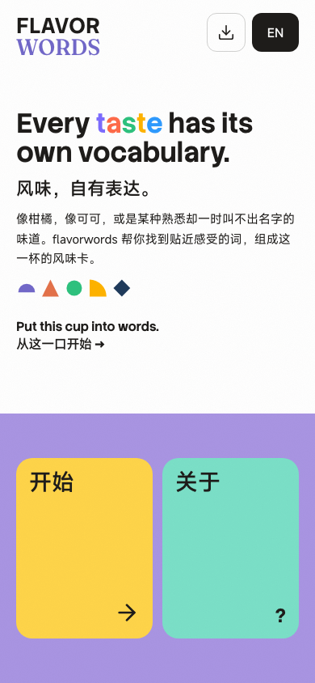
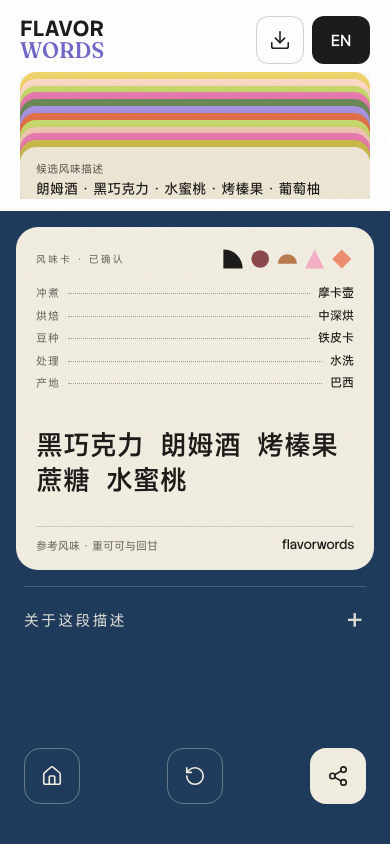
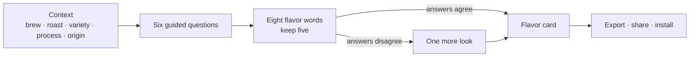
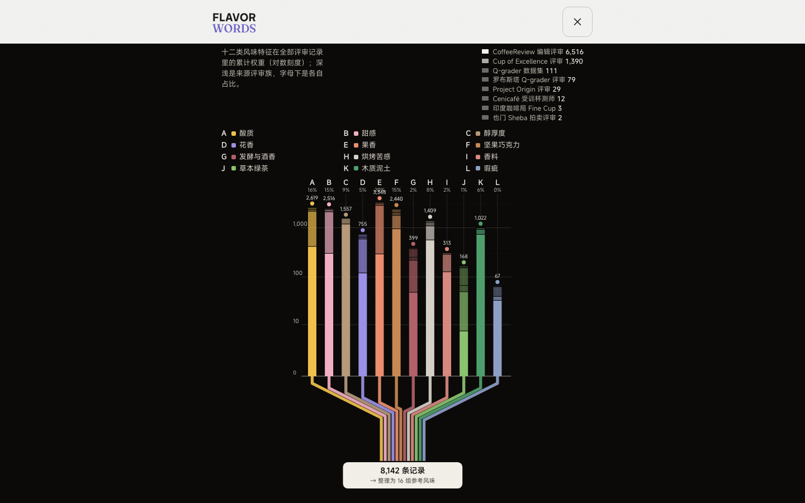
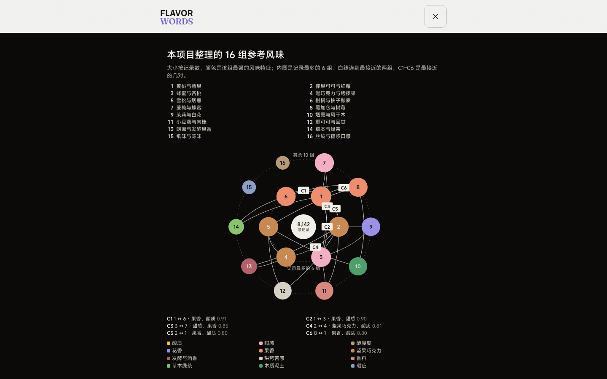

# flavorwords

**Put this cup into words. · 风味，自有表达。**

A bilingual coffee-tasting app that helps drinkers describe what they taste
through six guided questions, a choice of flavor words, and a personal flavor
card.

用几个简单问题，帮助咖啡饮用者把自己的感受整理成一张风味卡。项目从专业咖啡评审资料出发，
将分散的风味描述整理为可用于问答和匹配的数据，再通过中英双语应用交给日常饮用者使用。

**Try it:** [flavorwords.com](https://flavorwords.com) · works offline, installs
to the home screen on iOS, Android and HarmonyOS

**Research, design and development:** 潘岱 · Dai Pan · June to September 2026,
individually led, AI-assisted implementation

**Built on:** 9,128 coffee records · 83,031 flavor descriptions · 8 professional
review sources

<p align="center">
  
  &nbsp;&nbsp;
  
</p>

[What it does](#what-it-does) · [Why](#why) · [What I did](#what-i-did) ·
[How the data supports the product](#how-the-data-supports-the-product) ·
[How it is built](#how-it-is-built) · [Current status](#current-status) ·
[中文摘要](#中文摘要)

## What it does



1. **Say how the cup was made.** Brewing method, roast, variety, process and,
   if known, origin. This sets a starting reference from the corpus; it is not
   a verdict.
2. **Answer six plain questions** about acidity, aroma, sweetness, mouthfeel,
   bitterness and overall impression. Each question is rephrased from the
   previous answer, the options are re-ordered to fit this cup, and every
   question has an "I can't tell" exit.
3. **Pick five of eight flavor words.** Concrete references rather than
   adjectives: 葡萄柚, 茉莉花, 黑巧克力, 丝绒奶油. The drinker's picks carry more
   weight than the reference.
4. **Take one more look when the answers disagree.** If the answers conflict
   with the reference and the picks side with the drinker, one extra screen
   offers eight dimension words to confirm.
5. **Keep the card.** Context, five confirmed words, the nearest reference
   profile, and a fold that says where each sentence comes from. Export it as a
   1200×1200 PNG, share it, or install the app.

The Chinese and English versions share one data backend: switching language
re-derives the words, prompts and card without asking anything again.

## Why

Most people can tell that two coffees taste different. Far fewer can say how.
The professional vocabulary exists, but it lives in cupping forms, flavor
wheels and package notes that read like promises. A drinker at a café has a
few seconds of attention and a real impression that deserves better words
than "good" or "sour".

flavorwords asks a narrow question: can a short sequence of plain questions,
grounded in how professionals actually describe coffee, help a drinker name
what they taste without turning the moment into an exam? Two commitments
follow from that question: the words offered come from real professional
descriptions of real coffees, and the drinker's own description is the
centre of the result, with "none of these" always available.

## What I did

**Problem definition and product direction.** Started from the gap between
tasting a difference and describing it, and turned professional flavor
material into a question-and-answer tool for everyday drinking. Made the
drinker's own description the core of the result instead of asking them to
accept a preset answer.

**Data development.** Selected professional review sources one at a time
after reading their terms, and led the acquisition, duplicate-record
consolidation, description extraction and semantic normalisation that turn
scattered review text into one flavor representation per coffee. Built the
chain from coffee record to flavor vector, reference profile and the runtime
data package the app loads.

**Interaction and matching design.** Designed the brewing-context input, the
six dynamic questions, the candidate-word selection and the conditional
confirmation step, so that the reference data and the drinker's answers are
combined rather than ranked against each other, and the drinker can be
uncertain or disagree with the suggestion at every step.

**Product design and delivery.** Led the bilingual interface, all product
copy, the responsive PWA (phone, tablet, desktop), the offline experience, the
flavor-card export, deployment, and checks on real devices.

Implementation used an AI pair-programming tool (Claude Code); commits carry
the corresponding co-author trailer. The division held throughout: the
questions, the source decisions, the copy, the design calls and the device
checks were mine; the tool wrote code, measurements and drafts under those
decisions.

## How the data supports the product

The corpus is professional sensory description of coffee: editorial reviews,
competition jury sheets and trained-panel datasets. Producer marketing,
consumer reviews and social-media text were kept out on purpose.

```text
professional review material
  → extraction, cleaning and duplicate-record consolidation
  → canonical sensory concepts
  → flavor vectors and reference profiles
  → one runtime data package the app loads
```

The numbers mean different things and should not be added up:

<!-- prettier-ignore -->
| Figure | What it counts |
| --- | --- |
| 9,128 coffee records | Effective coffee records after duplicate consolidation; 8,142 of them carry enough description to become vectors <!-- claim: VECTOR_LIBRARY_COFFEES --> |
| 83,031 flavor descriptions | Descriptor assertions extracted from the review text; 77,637 remain after cleaning. Not 83,031 coffees, and not that many distinct words <!-- claim: CORPUS_SOURCE_ASSERTIONS --> |
| 94 canonical concepts | The normalised vocabulary layer, projected onto 12 flavor dimensions <!-- claim: CONCEPT_PROJECTION --> |
| 16 reference profiles | Formed offline by k-means over the usable vectors and named by the owner as two concrete sensory references each <!-- claim: PROFILE_LIBRARY --> |

<!-- prettier-ignore -->
| Source family | Coffee records with usable descriptions |
| --- | ---: |
| CoffeeReview editorial reviews | 6,516 |
| Cup of Excellence juries | 1,390 |
| Q-grader dataset (Zenodo, Golovinsky) | 111 |
| Robusta Q-grader panel (Frontiers, INERA) | 79 |
| Project Origin panel | 29 |
| Cenicafé trained cuppers (Frontiers) | 12 |
| Coffee Board of India Fine Cup | 3 |
| Sheba Yemen auction panel | 2 |

Two things make this data usable in the product rather than just large.
Duplicate consolidation means the same coffee published on a mirror, a score
sheet and a results table counts once. And the structure scores CoffeeReview
publishes (body, acidity) enter as measured axes, so the reference for "an
espresso, dark roast" comes from corpus rows, not from a guess.



At runtime, context builds a reference vector from measured corpus rows, the
six answers build the drinker's vector, and the target is a weighted
combination of the two matched against the sixteen profiles by cosine
similarity. A coherence check decides whether the extra confirmation step is
needed. The parameters, thresholds, the full dimension distribution and the
per-profile counts are in the
[design record](./docs/product/FLAVOR_VECTOR_DESIGN_V1.md) and shown on the
app's About pages.

Consumer wording for the questions was checked against aggregate term
frequencies from the Great American Coffee Taste Test (4,042 respondents,
counts only). <!-- claim: GACTT_AGGREGATE --> The research statements a card
can show come from a registered claims list: six are live, five are held
pending re-verification. <!-- claim: LITERATURE_CLAIMS_LIVE --> No source
text is stored in the repository, every dataset was approved individually
after reading its licence, and naming a specific commercial coffee is out of
scope for rights reasons. Details:
[product-vector-v1 data guide](./db/data/product-vector-v1/README.md),
[third-party notices](./THIRD_PARTY_NOTICES.md).



## What changed along the way

The most useful finding was that more coffee records did not mean more usable
flavor descriptions. A consumer-heavy acquisition route was the wrong kind of
evidence for a professional vocabulary. Competition archives added thousands
of coffees but few descriptions per coffee: scores, rankings and repeated
publication layers grew the record count without deepening it. The observation
grain was therefore changed from coffee rows to individual flavor descriptions,
and sources and parsers were repaired instead of relabelled.

The second change followed from the first. An earlier adaptive-question design
needed reviewed labels that do not exist yet. The vector representation works
from measured corpus rows, so the product could ship now, in two languages,
with every sentence on the card traceable to a row or a rule. The earlier
atlas prototype and the adaptive-question line are archived, not deleted; the
checkpoint history is in the
[project timeline](./docs/portfolio/PROJECT_TIMELINE.md).

## How it is built

```text
db/scripts/               data pipeline and builders (Python) → db/data/product-vector-v1/product-vector-v1.json
packages/flavor-data/     runtime: inference, question flow, session, bilingual presentation (TypeScript)
apps/pwa/                 Vue 3 + Tailwind + GSAP PWA: self-hosted fonts, Workbox precache, PNG export
db/migrations/            PostgreSQL 17 knowledge base for provenance, rights and review
tests/                    vitest suites for the model, session API, lexicon, personas and the confirmation step
```

- **Data build and app runtime are separate.** The pipeline produces one
  JSON bundle: dimensions, projection, the context and answer matrices, the
  sixteen profiles, the question bank with its prompt variants, and the
  bilingual presentation layer. The app loads that bundle and nothing else,
  which is what makes offline use and instant language switching possible.
- **Runtime is deterministic.** Vector arithmetic and rule-based interaction
  over measured matrices; no generative model, and every output traceable.
  k-means is used once, offline, to form the reference profiles.
- **Knowledge base.** PostgreSQL 17 with forward-only migrations models
  sources, provenance, rights dimensions, duplicate lineage and review
  receipts, so the corpus can be rebuilt and audited.
- **Verification on every push.** Unit tests, browser smoke tests, public
  claim contracts and a database gate run locally before each commit and on
  GitHub Actions. Every number in this README carries a marker checked
  against an evidence file.
- **Deployment.** Vercel builds the PWA from a clean clone; the two largest
  corpus ledgers are tracked with Git LFS.

```bash
npm ci
npm run pwa:dev          # http://localhost:5173
npm run pwa:build        # apps/pwa/dist
npm run test             # vitest
npm run ci:verify        # full gate (PostgreSQL 17 needed for the database stages)
```

## Current status

- **Live** at flavorwords.com, bilingual, offline, installable on three
  mobile platforms, with tablet and desktop layouts.
  <!-- claim: PWA_LIVE -->
- **Not yet validated with users.** No first-party interviews or usability
  sessions have been run and no interaction data is collected. What has been
  checked is implementation behaviour: all 18,432 possible answer sequences
  were enumerated (the extra confirmation step opens for 34.2% of them and
  never when the answers already agree) <!-- claim: Q6_TRIGGER_RATE --> and a
  324-user simulated query test found a nearest reference above 0.85 cosine
  for 281 of them. <!-- claim: QUERY_HORIZON_TEST --> Neither shows that the
  words are right for a real drinker.
- **Concept mapping awaits review.** The concept-to-dimension projection is an
  operator draft pending the owner's line-by-line pass.
- **Thin long tail.** Herbal, fermented, body-led and defective cups are
  sparsely described in the corpus; the app shows the count rather than
  filling the gap.
- **Scope.** The app returns reference profiles and words, not a specific
  commercial coffee. Similarity is cosine, uncalibrated, never a probability.

## 中文摘要

**产品**：flavorwords.com，中英双语咖啡品鉴应用。说明冲煮方式、烘焙度、豆种、处理法和产地，
回答六道随上一题变化的问题，从八个具体风味词里选五个，得到一张可导出、可分享的风味卡；
离线可用，iOS、安卓、鸿蒙都能添加到桌面。

**为什么做**：喝得出差别，说不出名字。专业词汇散落在杯测表、风味轮和包装描述里，日常场景用不上。
产品把专业描述变成几道简单问题，让饮用者自己的描述成为结果的核心，随时可以说"都不像"。

**我做了什么**：个人主导研究、产品设计、数据开发与交付，使用 AI 辅助实现。问题定义与产品方向；
专业来源逐一审阅选取、去重整合、描述提取、语义归一，建立从咖啡记录到风味向量与运行时数据包的
链路；语境输入、六道动态问题、候选词选择与条件式确认的交互与匹配设计；双语界面、全部文案、
响应式 PWA、离线、风味卡导出、部署与真机检查。

**数据如何支撑产品**：8 类专业评审来源，9,128 条咖啡记录（8,142 条足以成为向量），83,031 条
风味描述（清洗后 77,637 条），归一为 94 个规范概念，投影到 12 个风味维度，离线用 k-means
形成 16 组参考风味。链路：专业评审资料 → 提取、清洗与重复记录整合 → 规范感官概念 →
风味向量与参考风味 → 产品直接加载的数据包。

**研发判断**：更多咖啡记录不一定带来更多可用的风味描述。消费者路线不适合专业词汇目标，
竞赛档案增加了记录却没有增加描述，于是把观察粒度从咖啡条目改为单条风味描述；早先的自适应
问答线需要尚不存在的审阅标签，改用从语料实测得到的向量表示后，产品得以双语上线。

**技术与边界**：数据构建与应用运行分开，应用只加载一个 JSON 数据包，因此离线和即时切换语言；
运行时是确定性的向量匹配和规则化交互，不依赖生成式模型。尚未做第一方用户验证；概念到维度
的投影待逐项审阅；语料对草本、发酵、口感主导和瑕疵类描述稀疏；不推荐具体商业咖啡。

## Documentation

- Design and product: [Flavor Vector Design V1](./docs/product/FLAVOR_VECTOR_DESIGN_V1.md),
  [product contract](./docs/product/PRODUCT_CONTRACT_V1.md),
  [copy review](./docs/product/FRONTEND_COPY_REVIEW.md),
  [confirmation-step test set](./docs/product/Q6_TRIGGER_TEST_SET.md)
- Data and engineering: [product-vector-v1 data guide](./db/data/product-vector-v1/README.md),
  [database guide](./db/README.md), [architecture](./docs/ARCHITECTURE.md),
  [deployment](./docs/deploy/VERCEL_DEPLOYMENT.md)
- Governed status and claims: [generated status](./PROJECT_STATUS.md),
  [public claims register](./docs/portfolio/PUBLIC_CLAIMS_REGISTER.tsv),
  [screenshot manifest](./docs/portfolio/SCREENSHOT_MANIFEST.md)
- History: [portfolio overview](./PORTFOLIO.md),
  [timeline](./docs/portfolio/PROJECT_TIMELINE.md),
  [iteration story](./docs/portfolio/RESEARCH_ITERATION_STORY.md),
  [documentation index](./docs/INDEX.md)
- Research protocols: [user research](./docs/user-research/USER_RESEARCH_OVERVIEW.md),
  [ML readiness](./docs/ml/README.md)

## Rights and licences

Software is MIT licensed; project-authored research prose and curated content
use the repository's documented CC BY layer; third-party material retains its
source terms. Fonts are self-hosted: Fraunces and Stack Sans under the SIL Open
Font License, MiSans under Xiaomi's MiSans licence. See
[license scope](./docs/LICENSE-SCOPE.md),
[third-party notices](./THIRD_PARTY_NOTICES.md) and
[asset licenses](./docs/ASSET-LICENSES.md). Cite with
[CITATION.cff](./CITATION.cff).
