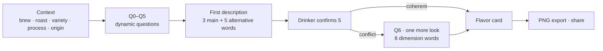
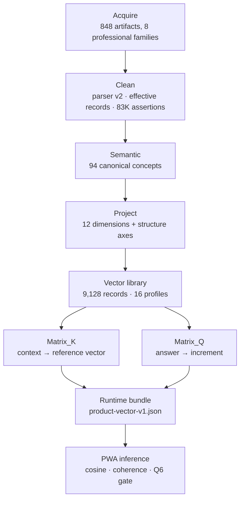

# flavorwords

> Put this cup into words. A data product that turns what a coffee drinker
> tastes into a small, defensible flavor vocabulary, built on 83K professional
> sensory assertions and shipped as a bilingual, offline-capable PWA.

> 风味，自有表达。一个把"这一口喝到了什么"变成可靠风味词的数据产品：底层是
> 8.3 万条专业感官断言整理成的 12 维风味向量，前端是中英双语、可离线、可安装的 PWA。

**Data product R&D · Sensory corpus engineering · PostgreSQL knowledge base · Vue 3 PWA**

**Live:** [flavorwords.com](https://flavorwords.com) · **Data checkpoint:** 83K
(parser v2, frozen) · **Inference:** deterministic vector arithmetic, no
machine-learned model · **Status:** product live, corpus frozen, model work not
started

[中文摘要](#中文摘要) · [Data](#data-what-the-product-stands-on) ·
[Method](#method-how-a-cup-becomes-words) · [Product](#product-what-the-user-does) ·
[Engineering](#engineering-how-it-is-built-and-verified) ·
[Contribution](#contribution-and-working-method) · [Status and limits](#status-and-limits)

<p align="center">
  
  &nbsp;&nbsp;
  
</p>

## The problem

Most people can tell that two coffees taste different. Far fewer can say how.
The professional vocabulary exists, but it lives in cupping forms, flavor
wheels and package notes that read like promises. A drinker at a café has a
few seconds of attention and a real impression that deserves better words than
"good" or "sour".

flavorwords asks a narrow question: can a short sequence of plain questions,
grounded in how professionals actually describe coffee, help a drinker name
what they taste without turning the moment into an exam?

The constraint that shaped everything: the words offered must come from real
professional descriptions of real coffees, with their provenance and rights
tracked, and the drinker must always be able to say "none of these".

## 中文摘要

**项目性质**：个人主导的数据产品研发项目，从数据获取、清洗、语义归一到产品推理模型、
前端与部署全链路完成，2026 年 6 月启动，9 月上线。

**问题**：普通饮用者喝得出差别，说不出名字。专业风味词汇存在，但散落在杯测表、风味轮和
包装描述里，日常场景用不上。

**数据**：8 个专业评审来源族（CoffeeReview 编辑评审、Cup of Excellence 评审、Q-grader
数据集等）的 9,128 条有效咖啡记录，解析出 83,031 条描述断言（77,637 条有效），归一到 94 个
规范概念，再投影到 12 个风味维度。仓库只保存概念 id 与聚合统计，不保存任何来源原文；
每个数据源逐一审阅授权后才进入。

**方法**：语境（冲煮方式、烘焙度、豆种、处理法、产地）从语料矩阵给出初始参考向量
V_pred；6 道动态问答给出用户向量 V_user，题面与选项顺序随上一题答案变化；两者的差异
ΔV 按 α = 0.5 合成目标向量，与 16 组参考风味（对 8,142 条可用向量做 k-means）做余弦
匹配；一致性检查在分歧时开启第二轮确认（穷举 18,432 条答题序列，34.2% 会触发）。
输出是一张风味卡：3 个主词、5 个备选，用户确认 5 个；卡片上每条说明按证据类型标注
（初始参考、资料统计、研究参考、你的描述）。

**产品**：flavorwords.com，Vue 3 + Tailwind + GSAP 的 PWA，中英双语，离线可用，
iOS / Android / 鸿蒙三端可添加到桌面，风味卡可导出 1200×1200 PNG。

**工程**：PostgreSQL 17 知识库（60 次前向迁移），229 个数据脚本，提交门禁 = 网页
检查 + 17 个数据库阶段，99 个单元测试 + 15 个端到端冒烟，Git LFS 承载两份超过
100 MB 的账本，Vercel 托管。

**我的贡献**：研究、设计与开发均由本人完成，所有产品决策记录在 25 条决策台账
（R3-D1 … R3-D25）中；实现过程使用 AI 结对编程工具（Claude Code）辅助，提交记录
中有相应署名。

## Product: what the user does



1. **Context first.** How was it made (nine brewing methods), how dark, which
   variety, which process, optionally where from (nineteen origins by
   continent). This gives a starting reference, not a verdict.
2. **Six plain questions.** Acidity, aroma, sweetness, mouthfeel, bitterness,
   overall impression. Each prompt is rewritten from the previous answer
   ("柑橘那种酸之后，闻起来最像什么？") and the options are re-ordered by how
   well they fit this cup and these answers. Every question has an "I can't
   tell" exit.
3. **Eight candidate words, keep five.** Concrete words, not adjectives:
   葡萄柚, 茉莉花, 黑巧克力, 丝绒奶油. The drinker's picks are the strongest
   signal in the whole flow.
4. **A second look when the answers disagree.** If the answers conflict with
   the reference and the picks side with the drinker, one more screen offers
   eight dimension words to confirm. Measured over every possible answer
   sequence, it opens for about a third of sessions and never when the answers
   are already coherent.
5. **A flavor card.** The cup's context, five confirmed words, the nearest
   reference profile, and a fold that explains where each sentence comes from,
   labelled by kind of evidence. Export as a 1200×1200 PNG, share, or install
   the app to the home screen (iOS, Android and HarmonyOS all have a path).

Two languages share one vector backend: the words, prompts and card are
re-derived in the other language without re-asking anything.

## Data: what the product stands on

### Corpus

The corpus is professional sensory description of coffee: editorial reviews,
competition jury sheets, trained-panel datasets. Each source was reviewed and
approved individually for rights before ingestion. Producer marketing, consumer
reviews and social-media text were deliberately kept out of the professional
corpus.

<!-- prettier-ignore -->
| Source family | Usable coffee records | What it is |
| --- | ---: | --- |
| CoffeeReview editorial reviews | 6,516 | Editorial tasting reviews with 1–10 structure scores (body, acidity) |
| Cup of Excellence juries | 1,390 | Competition jury descriptors |
| Q-grader dataset (Zenodo, Golovinsky) | 111 | Certified grader sheets |
| Robusta Q-grader panel (Frontiers, INERA) | 79 | Published panel data |
| Project Origin panel | 29 | Producer-side professional panel |
| Cenicafé trained cuppers (Frontiers) | 12 | Research panel |
| Coffee Board of India Fine Cup | 3 | Competition sheets |
| Sheba Yemen auction panel | 2 | Auction jury sheets |
| **Total usable** | **8,142** | of 9,128 effective coffee records |

The 83K checkpoint holds 83,031 descriptor assertions, of which 77,637 are
valid after cleaning; they normalise to 88,819 output atoms, 71,521 unique per
record. <!-- claim: CORPUS_SOURCE_ASSERTIONS --> The vector library covers
9,128 effective coffee records, 8,142 of them with at least two mapped mentions
and therefore usable as vectors. <!-- claim: VECTOR_LIBRARY_COFFEES -->

"Effective record" matters: the same coffee published on a mirror, a score
sheet and a results table is one record, not three. The pipeline separates
source files, publication rows, effective records, descriptor assertions,
human review and model eligibility, so an acquisition total is never presented
as a labelled dataset.

### Vocabulary and dimensions

94 canonical sensory concepts carry the corpus vocabulary. Each concept is
projected onto 12 flavor dimensions (acidity, sweetness, body, floral, fruity,
nutty & chocolate, fermented & winey, roast & bitter, spice, herbal & green,
woody & earthy, defect). <!-- claim: CONCEPT_PROJECTION -->
CoffeeReview's editorial body and acidity scores enter as rank percentiles,
weighted 0.6 against the descriptor axes, so structure is measured rather than
guessed.

How the corpus mass falls across the twelve dimensions (share of coffees whose
strongest axis is this one):

<!-- prettier-ignore -->
| Dimension | Top-axis share | Dimension | Top-axis share |
| --- | ---: | --- | ---: |
| Fruity | 31.7% | Woody & earthy | 5.1% |
| Nutty & chocolate | 22.7% | Floral | 4.7% |
| Sweetness | 20.3% | Roast & bitter | 3.3% |
| Acidity | 9.7% | Spice | 1.8% |
| Herbal & green | 0.3% | Fermented & winey | 0.2% |
| Body | 0.1% | Defect | 0.1% |

The long tail is real: the corpus barely describes herbal, fermented, body-led
and defective cups, and the product says so instead of inventing coverage.


### Reference profiles

Deterministic k-means over the 8,142 usable vectors gives 16 reference
profiles. Names are two concrete sensory references chosen by the owner, not
cluster labels. <!-- claim: PROFILE_LIBRARY -->

<!-- prettier-ignore -->
| Profile | Records | Profile | Records |
| --- | ---: | --- | ---: |
| Yellow Peach & Ripe Fruit · 黄桃与熟果 | 1,343 | Jasmine & White Flowers · 茉莉与白花 | 387 |
| Hazelnut Cocoa & Red Berry · 榛果可可与红莓 | 1,169 | Smoke & Aged Wood · 烟熏与风干木 | 325 |
| Honey & Apricot · 蜂蜜与杏桃 | 983 | Cardamom & Cinnamon · 小豆蔻与肉桂 | 273 |
| Dark Chocolate & Roasted Hazelnut · 黑巧克力与烤榛果 | 757 | Dark Cocoa & Sweet Finish · 重可可与回甘 | 217 |
| Cedar & Smoke · 雪松与烟熏 | 720 | Rum & Fermented Fruit · 朗姆与发酵果香 | 60 |
| Citrus & Yuzu Acidity · 柑橘与柚子酸质 | 639 | Herbal & Green Tea · 草本与绿茶 | 47 |
| Cane Sugar & Honey · 蔗糖与蜂蜜 | 606 | Papery & Stale · 纸味与陈味 | 12 |
| Blackcurrant & Raspberry · 黑加仑与树莓 | 592 | Velvet & Syrup Mouthfeel · 丝绒与糖浆口感 | 12 |


### Literature and consumer language

Research statements on the card come from a claims registry with a review
state per claim. Six claims are live (World Coffee Research sensory lexicon,
Coffee Ad Astra extraction physics); five are held pending re-verification,
including four whose cited DOI did not resolve to a coffee paper.

<!-- claim: LITERATURE_CLAIMS_LIVE --> Consumer wording for the questions was

checked against aggregate term frequencies from the Great American Coffee
Taste Test, 4,042 respondents, counts only, no text retained.

<!-- claim: GACTT_AGGREGATE -->

### Rights posture

- No source text is stored in the repository; vectors and counts derive from
  canonical concept ids.
- Every dataset was approved one at a time after reading its licence;
  attribution is not treated as permission.
- Public web access is never treated as reuse permission. Recommending a
  specific CoffeeReview coffee inside a public product is out of scope.
- The restricted source root stays offline; the two source-assertion ledgers
  over 100 MB are tracked with Git LFS.

## Method: how a cup becomes words



**Vectors, not labels.** Every coffee record, every context and every answer
lives in the same 12-dimensional unit space. Context builds a reference vector
`V_pred = normalize(ΣK)` from measured corpus rows (brew method, roast, variety,
process, an optional origin bias of 0.1). Answers build `V_user =
normalize(ΣQ)`. The difference `ΔV` is a difference, not an error: the target
is `V_pred + α·ΔV` with α = 0.5, raised to 0.9 after the second look.

**Coherence instead of confidence.** The flow checks whether the answers hold
together in profile-signature space, with thresholds 0.80 (coherent) and 0.65
(mild). Absence answers ("甜感不明显") cap the check at mild so silence is never
read as conflict. The second-look gate opens only on a conflict path when the
drinker's five picks side with their own answers rather than the reference.
Enumerated over all 18,432 answer sequences of the bank across six contexts,
34.2% open the second round with the default picks, 63.3% when the picks lean
to the drinker, and 0% on the coherent path. <!-- claim: Q6_TRIGGER_RATE -->

**Dynamic questions.** Prompts have variants keyed to the previous answer, and
options are ranked by the cosine between the option's increment and the
running vector. The bank has 6 slots with 4/4/4/4/3/4 options; the words are
concrete flavor references, and the adjective forms survive only as aliases
for the free-text mapper.

**Evidence labelling on the card.** Each line of the fold is one of five
displayable states: reference basis (computed from context), corpus measured
(a real count from one context row), literature claim (registered source,
second phrasing available), computed delta (the difference between the
drinker's description and the reference), product note (defect handling).
Owner opinions are a sixth state that is never shown.

**Sufficiency was measured before shipping.** The owner set four criteria:
coverage (8,142 usable of 9,128), uniformity (the top-axis table above),
a query-horizon test and the profile naming pass. In the query-horizon test,
324 simulated drinkers each found a nearest coffee at mean cosine 0.934
(minimum 0.779), 281 of them with all three nearest above 0.85, and 270
distinct coffees appeared across the top-3 lists.

<!-- claim: QUERY_HORIZON_TEST --> Similarity is cosine, uncalibrated, and is

never presented as a probability.

**What the method is not.** There is no machine-learned model in the product.
The inference is arithmetic over measured matrices, which keeps every output
traceable to a row and a rule. The ML programme (descriptor normalisation,
candidate ranking, adaptive stopping) is defined with label sources, split
units and abstention behaviour, and is blocked on reviewed labels and
model-use rights, not on engineering.

## Engineering: how it is built and verified

```text
apps/pwa/                 Vue 3 + Tailwind v3 + GSAP PWA (isolated, self-hosted fonts, Workbox)
packages/flavor-data/     product-vector-v1 runtime: engine · flow · session · view · about · lexicon
db/data/product-vector-v1 runtime bundle, matrices, profiles, lexicon, literature registry, measurement
db/data/current/          83K checkpoint ledgers and manifests (two ledgers in Git LFS)
db/scripts/               229 pipeline, builder and verification scripts (Python)
db/migrations/            PostgreSQL 17 knowledge base, 60 forward migrations
tests/                    vitest suites for the model, session API, lexicon, personas, Q6 reachability
docs/product/             design record, product contract, copy review, Q6 test set
```

- **Runtime bundle.** `build-matrix-k-v1.py` and `build-product-vector-v1.py`
  turn the checkpoint into one JSON bundle the PWA loads offline: dimensions,
  projection, Matrix_K, Matrix_Q, 16 profiles, the question bank with prompt
  variants, the bilingual presentation layer and the evidence templates.
- **Knowledge base.** PostgreSQL 17 with forward-only migrations, fail-closed
  constraints and disposable-database tests; provenance, evidence tier, rights
  dimensions, duplicate lineage and review receipts are modelled, not implied.
- **Commit gate.** `npm run ci:verify` runs the web checks (generated-artifact
  drift, public claim contracts, Prettier, typecheck, 99 unit tests, build,
  15 Playwright smoke tests) and then 17 database stages, including a clean
  two-pass rebuild; the historical replay stage is opt-in. The same jobs run on
  GitHub Actions on every push to `main`.
- **Copy as data.** Every user-facing string lives in `view.ts` and `about.ts`
  and is exported to a review document, so the owner reviews copy in one
  table rather than in components.
- **Deployment.** Vercel builds `apps/pwa` from a clean clone with Git LFS
  disabled; the PWA precaches the shell, fonts and bundle, serves a web app
  manifest with PNG and maskable icons, and installs on iOS Safari, Android
  Chrome/Edge and HarmonyOS Huawei Browser. <!-- claim: PWA_LIVE -->

Local setup:

```bash
npm ci
npm run pwa:dev          # http://localhost:5173
npm run pwa:build        # apps/pwa/dist
npm run test             # vitest
npm run ci:verify        # full gate (needs PostgreSQL 17 for the database stages)
```

## Contribution and working method

Research, design and development: 潘岱 · Dai Pan. One person carried the
project from source acquisition and rights review through the data pipeline,
the vector model, the product design and the PWA, and every product decision
is recorded in the owner decision ledger (R3-D1 … R3-D25, in
`db/data/backend-sequential-model-v2/revisions/round3/`), each entry with the
owner's words, what was applied and how it was verified.

Implementation used an AI pair-programming tool (Claude Code); commits carry
the corresponding co-author trailer. The division of labour was consistent
throughout: the owner set the questions, chose and approved every data source,
wrote and reviewed all product copy, made every design call and verified the
result on real devices; the tool produced code, measurements and drafts under
those decisions. Data sources were never scraped from Chinese social media, and
no participant, quote or finding is fabricated anywhere in the repository.

## Research journey

The project began in June 2026 with a bilingual sensory vocabulary and an
exploratory atlas interface, then built the PostgreSQL system of record. The
most useful results were negative: a consumer-heavy acquisition route was
invalid for the professional-label goal, and competition archives added
population without adding descriptor depth. The observation grain was changed
from coffee rows to governed descriptor assertions, then the corpus was rebuilt
through 30K, 40K, 50K, 77K and 83K checkpoints as parsers and sources were
repaired rather than relabelled.

On 12 September 2026 the product line pivoted from an adaptive question policy
to the flavor vector space: one deterministic backend, two languages, evidence
labelled on the card. The PWA was designed, reviewed in six owner rounds and
shipped the next day. The earlier atlas prototype and the adaptive-question
line are archived, not deleted, so their receipts stay reproducible.

## Status and limits

- **Live:** flavorwords.com, bilingual, offline, installable on three mobile
  platforms, tablet and desktop layouts.
- **Corpus:** frozen at the 83K checkpoint; the concept-to-dimension
  projection is an operator draft awaiting the owner's line-by-line review.
- **Long tail:** herbal, fermented, body-led and defective cups are thinly
  described in the corpus; the product shows the count rather than filling
  the gap.
- **Public recommendation:** naming a specific commercial coffee is out of
  scope for rights reasons; the product returns reference profiles and words.
- **No first-party user research yet:** interview and usability protocols
  exist; no sessions have been run and no interaction data is collected.
- **No machine-learned model:** by design at this stage; the readiness
  matrix defines what would have to be true first.

## Documentation map

- Design record: [Flavor Vector Design V1](./docs/product/FLAVOR_VECTOR_DESIGN_V1.md),
  [product contract](./docs/product/PRODUCT_CONTRACT_V1.md),
  [copy review](./docs/product/FRONTEND_COPY_REVIEW.md),
  [Q6 trigger rate and test set](./docs/product/Q6_TRIGGER_TEST_SET.md)
- Data: [product-vector-v1 directory guide](./db/data/product-vector-v1/README.md),
  [database guide](./db/README.md), [architecture](./docs/ARCHITECTURE.md)
- Deployment: [Vercel form sheet](./docs/deploy/VERCEL_DEPLOYMENT.md)
- Governed status and claims: [generated status](./PROJECT_STATUS.md),
  [public claims register](./docs/portfolio/PUBLIC_CLAIMS_REGISTER.tsv),
  [screenshot manifest](./docs/portfolio/SCREENSHOT_MANIFEST.md)
- Research history: [portfolio overview](./PORTFOLIO.md),
  [timeline](./docs/portfolio/PROJECT_TIMELINE.md),
  [iteration story](./docs/portfolio/RESEARCH_ITERATION_STORY.md),
  [documentation index](./docs/INDEX.md)
- User research and ML readiness:
  [overview](./docs/user-research/USER_RESEARCH_OVERVIEW.md),
  [ML documents](./docs/ml/README.md)

## Rights and licences

Software is MIT licensed; project-authored research prose and curated content
use the repository's documented CC BY layer; third-party material retains its
source terms. Fonts are self-hosted under their own licences: Fraunces and
Stack Sans under the SIL Open Font License, MiSans under Xiaomi's MiSans
licence. See [license scope](./docs/LICENSE-SCOPE.md),
[third-party notices](./THIRD_PARTY_NOTICES.md) and
[asset licenses](./docs/ASSET-LICENSES.md). Cite the repository with
[CITATION.cff](./CITATION.cff).
