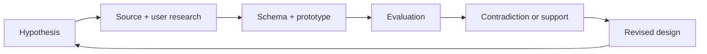

# Case study — from vague perception to governed sensory references

## Challenge

An ordinary coffee drinker may notice that one cup feels brighter, sweeter, or
more aromatic than another while still struggling to name the impression. A
professional term can be unfamiliar. A package note can feel like a target to
match. A full tasting form can impose more structure than the moment needs.

Coffee Flavor Atlas treats those frictions as a human-centered research problem:
how might a product offer helpful language without marking a personal
perception wrong, suggesting an answer too strongly, or pretending that flavor
is a single objective label?

## Initial hypothesis

The design hypothesis is that a short adaptive interaction may help ordinary
drinkers move from broad perception to more specific sensory references without
requiring trained cupping vocabulary. Preparation and roast can provide soft
context; explicit sensory answers should dominate when they conflict with that
context; uncertainty and “none of these” should remain valid.

This remains a hypothesis. First-party user testing has not yet occurred.

## Research approach

The project combines several forms of work that are intentionally kept distinct:

- literature, standards, and sensory-method desk research;
- professional source discovery and descriptor-field auditing;
- corpus acquisition, file hashing, source-specific parsing, and duplicate
  forensics;
- PostgreSQL schema design for knowledge, observations, provenance, context,
  review, rights, calibration, model work, and audit;
- product semantics for a low-burden, uncertainty-preserving interaction;
- future interview, usability, and consented interaction-data protocols; and
- deterministic and future ML evaluation planning with grouped splits.

The current cycle status is **IMPLEMENTED** for schema, prototype, and
repository normalization; **VALIDATED** for recorded database and frontend
checks; **NOT_STARTED** for first-party fieldwork and model runs.

## Iteration and correction

### Foundation: separate knowledge from observations

**Hypothesis.** A bilingual descriptor atlas could be expanded into a
research-grounded product if its sensory knowledge and language evidence were
made explicit.

**Work and evidence.** The project created a PostgreSQL knowledge core,
source-versioned provenance, rights policies, corpus observations, deterministic
retrieval, audit trails, and reproducible migrations.

**Result and decision.** A descriptor is not an observation, and an observation
is not a model label. That separation became the central architecture rule.

### Context: make preparation and roast explicit

**Hypothesis.** Preparation and roast context can improve candidate relevance.

**Work and evidence.** C0 preparation families, C1 roast categories, measured
and unresolved evidence states, and an adaptive-question product contract were
specified. Calibration study and capture contracts were dry-run with synthetic
test fixtures only.

**Result and decision.** Context is useful as a soft prior, not as a way to
generate a flavor label. Unknown database observations remain different from
mandatory interface choices.

### Round 3J: acquisition strategy invalidated

**Hypothesis.** Scaling readily available coffee-review sources might supply a
large professional corpus.

**Implementation and measurement.** The attempted route selected a
consumer-heavy population and used a grain that did not correspond to one
professional coffee descriptor observation. The preserved
[failure diagnosis](../audits/coffee-sensory-kb-v0-round3k/01_RECOVERY_AND_BASELINE.md)
records why the branch was not merged.

**Contradiction.** Consumer reviews are valuable language evidence, but not
professional judging truth. Acquisition volume could not repair a source-role
error.

**Decision.** Preserve the failed route as audit evidence, keep useful
governance semantics, and restart from a professional competition census.

### Round 3L: anti-inflation result

**Hypothesis.** A broad competition source universe might reach the professional
record target.

**Work and evidence.** The project reconciled source families and editions,
acquired accessible artifacts, parsed result archives, constructed effective
records, and counted descriptor-bearing evidence separately from rows and
publications.

**Contradiction.** Rankings, scores, awards, blank sheets, publication mirrors,
and repeated services created source population but not sensory descriptors.
Field richness did not prove jury provenance. A large publication-row count did
not create a large professional descriptor corpus.

**Decision.** Stop treating record population as the readiness unit. Preserve
the acquisition census while changing the gate to reviewed descriptor
assertions.

### Round 3M: descriptor-first and review-governance correction

**Hypothesis.** Descriptor readiness becomes auditable when every assertion is
bound to source-native text, a source locator, record identity, evidence tier,
rights state, duplicate lineage, and review state.

**Work and evidence.** The project reconciled a descriptor-first baseline,
admitted a public-safe hash-only pilot, enforced assertion-level de-inflation,
record-level uniqueness, co-assertion semantics, and C0/C1 preservation. It then
closed a self-attestation gap: human claims require acquired qualification,
scope-specific admission, and row-level decision evidence.

**Result and decision.** Unsupported human and expert counts correctly remain
zero. A syntactically valid hash or reviewer code cannot create review credit.
The [Round 3M executive receipt](../audits/coffee-sensory-kb-v0-round3m/00_EXECUTIVE_RECEIPT.md)
records the gate, tests, and remaining blockers.

## Database contribution

The database models claim type before scale.

- **Canonical knowledge** stores governed concepts, labels, and relationships.
- **Observations** preserve what a source actually says, without silent
  canonical promotion.
- **Source artifacts** retain version, hash, bounded locator, acquisition state,
  and supplying authority.
- **Evidence tiers** distinguish professional, industry, commercial, consumer,
  and unresolved origins.
- **Rights dimensions** independently govern research, model use, deployment,
  raw redistribution, and derived output.
- **Effective coffee records** and publication layers prevent mirrors, score
  views, or repeated services from becoming new coffees.
- **Review receipts** bind decisions to governed evidence and append-only
  successor chains.
- **Model-eligible views** fail closed when evidence, review, provenance, rights,
  or gate requirements are absent.

Migrations and tests reconstruct these rules in disposable PostgreSQL databases.
Historical research, expected-state manifests, and generated receipts make the
system inspectable beyond prose.

## User-research contribution

The intended users are not professional cuppers. Research questions focus on
ordinary-language vocabulary, unfamiliar descriptors, suggestion bias,
question burden, context-prior override, abstention, candidate comprehension,
comparison usefulness, and recall.

The documentation separates external consumer review mining, interviews and
usability observations, and product interaction events. User feedback may
support qualitative themes, comprehension improvements, question wording, or
future behavioral relevance. It cannot become professional ground truth. Every
future insight must link to a session or artifact, contradictory evidence,
confidence, and status. No user evidence is claimed in advance.

## ML/DL contribution

Deterministic lexical and governed relationship retrieval is Level 0: the
baseline that any learned system must beat. The future task map separates
professional descriptor normalization, candidate ranking, association
estimation, question selection, stopping, and consumer-language mapping.

Those tasks do not share one universal “accuracy.” Normalization requires
reviewed professional targets and abstention metrics. Candidate ranking needs
grouped coffee/source-family evaluation and rank metrics. Question policy needs
interaction burden and information-gain measures. User research needs
comprehension, usefulness, confidence, and trust evidence.

Deep learning is not justified by database size alone. It requires enough
reviewed labels, lawful model rights, stable retrieval candidates, leakage-safe
holdouts, and a demonstrated incremental benefit over interpretable baselines.
The current model status is explicitly `NOT_TRAINED`.

## Outcome by status

| Status                   | Outcome                                                                                                                                                |
| ------------------------ | ------------------------------------------------------------------------------------------------------------------------------------------------------ |
| IMPLEMENTED              | Atlas prototype, product contract, governed database schema, deterministic retrieval foundation, acquisition/review contracts, public status generator |
| VALIDATED                | Recorded PostgreSQL migrations and invariants, clean rebuild receipts, frontend checks, descriptor anti-inflation and fail-closed review behavior      |
| DESIGNED BUT UNVALIDATED | Interview/usability study, first-party event model, candidate-ranking evaluation, adaptive question/stopping evaluation                                |
| BLOCKED                  | Professional label and model surfaces that require qualified review and rights-cleared evidence                                                        |
| PLANNED                  | Installable PWA shell, consented first-party pilot, staged statistical and ranking baselines                                                           |
| NOT_STARTED              | Participant sessions and all model runs                                                                                                                |

## Current implications

The project is valuable today as a product-framing, data-governance, database,
retrieval, and research-method case study. It is not presented as a completed
user study or an ML product. The next stage should add evidence—not a more
confident marketing adjective.

[Current status](../../PROJECT_STATUS.md) ·
[User research](../user-research/USER_RESEARCH_OVERVIEW.md) ·
[ML readiness](../ml/ML_DATA_READINESS_MATRIX.md)
