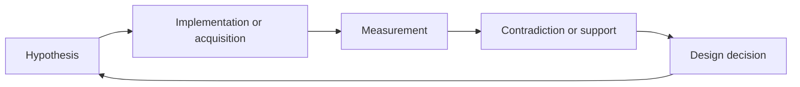

# Research iteration story

Coffee Flavor Atlas developed through repeated cycles of assumption, evidence,
contradiction, and correction. The negative results are not erased; they explain
why the current boundaries exist.

## 1. A visual vocabulary needs a claim model

**Assumption:** an interface and curated descriptor set could carry the project.

**Evidence:** the atlas made bilingual vocabulary explorable, but draft sensory
ranges could not represent source-native claims, conflicting evidence, rights,
or observation context.

**Decision:** keep the interface as a prototype and create a PostgreSQL system
of record that distinguishes concepts, observations, evidence, and model output.

## 2. More context is not more truth

**Assumption:** preparation and roast context should improve relevance.

**Evidence:** context can narrow plausible references, but database unknowns,
roast schemes, measurement methods, and user-facing categories have different
semantics.

**Decision:** model C0/C1 explicitly, use context as a soft prior, and allow
sensory answers to override it. No roast level may be inferred from tasting
descriptors alone.

## 3. Protocol infrastructure is not participant evidence

**Assumption:** a well-defined study and capture system can prepare adaptive
question calibration.

**Evidence:** a synthetic dry run can validate schema and workflow behavior,
but cannot reveal comprehension, trust, burden, or usefulness.

**Decision:** preserve the validated protocol infrastructure while keeping
participant findings at `NOT_YET_TESTED` and empirical counts at zero.

## 4. High-volume acquisition can select the wrong population

**Assumption:** readily available coffee reviews could accelerate professional
label acquisition.

**Evidence:** Round 3J selected a consumer-heavy population and an unsuitable
grain. Review text could inform consumer-language research, but not professional
judging labels.

**Decision:** preserve the failure branch as evidence, do not merge it, and
restart with competition-native rules in Round 3K.

## 5. Competition scale is not descriptor scale

**Assumption:** a comprehensive competition census could satisfy a large
professional record target.

**Evidence:** Round 3L found many artifacts and publication rows, but most
available fields were rankings, scores, results, repeated views, or otherwise
not qualified descriptor text. Source-field richness did not establish jury
provenance. Deduplication and effective-record construction reduced apparent
scale further.

**Decision:** preserve acquisition counts as acquisition counts. Gate model
readiness on reviewed P1/P2 strict descriptor assertions with companion source,
rights, diversity, and evaluation requirements.

## 6. Immutable self-attestation is still self-attestation

**Assumption:** append-only review receipts and an evidence hash might prove
human review.

**Evidence:** a reviewer code and arbitrary hash can be syntactically valid
without proving qualification, admission, or a row-level decision.

**Decision:** Round 3M bound human/expert claims to acquired qualification
artifacts, scope-specific admission, row-level decision evidence, exact field
matching, and versioned successors. Unsupported production counts stay zero.

## 7. Public presentation needs executable truth boundaries

**Assumption:** a polished README alone could make the work legible.

**Evidence:** narrative facts occur in governed receipts, generated artifacts,
historical documents, and UI copy. Manual synchronization invites stale phases,
false PWA/model language, and collapsed count universes.

**Decision:** generate public status from receipts, register quantitative
claims, lint public language, validate links/indexes/screenshots, and keep
historical files untouched.

## Current interpretation

The current achievement is a validated database and research foundation plus a
mobile-first interface prototype. First-party user evidence, reviewed
professional label scale, model-use rights, installable PWA behavior, and model
evaluation remain future work. The next stage should be chosen for the evidence
it adds, not for the technology label it permits.
