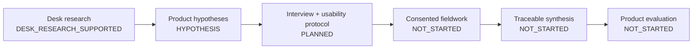

# User-research overview

## Current state

`USER_RESEARCH_STATUS=PLANNED`

`USER_DATA_COLLECTED=false`

`INTERVIEW_COUNT=0`

`USABILITY_SESSION_COUNT=0`

Coffee Flavor Atlas investigates whether ordinary coffee drinkers can move from
a broad perception to clearer sensory language through a low-burden,
uncertainty-preserving interaction. The current repository defines the research
questions, target users, guide, metrics, consent boundaries, future event model,
and traceability workflow. It does not contain participant evidence.

## Research program

## Four evidence tracks

### Track A — professional sensory evidence

Governed professional material can support descriptor grounding,
normalization, candidate references, association analysis, and future held-out
evaluation. Scores, rankings, blank forms, judge rows, repeats, and unresolved
fields do not become descriptor labels.

### Track B — industry and commercial language

Producer, competitor, roaster, and commercial expressions may support
vocabulary discovery, package-note comparison, wording variation, and mismatch
analysis. They are not automatically professional ground truth.

### Track C — consumer language

Lawfully available consumer language may reveal familiar expressions,
ambiguity, confusion, expectation, or disagreement with package notes. It is
evidence about communication, not authoritative evidence of one correct flavor.

### Track D — future first-party data

Consented interviews, usability observations, and interaction events may reveal
task burden, comprehension, candidate interpretation, trust, abstention, and
behavioral relevance. These are not objective flavor truth.

## Research-state vocabulary

All findings must use one of:

- `HYPOTHESIS`
- `DESK_RESEARCH_SUPPORTED`
- `OBSERVED_SINGLE_SESSION`
- `RECURRING_QUALITATIVE_PATTERN`
- `QUANTITATIVELY_SUPPORTED`
- `CONTRADICTED`
- `NOT_YET_TESTED`

The current [findings register](./FINDINGS_STATUS.md) contains hypotheses and
not-yet-tested questions only. No synthetic quote is permitted.

## Documents

- [Target users and scenarios](./TARGET_USERS_AND_SCENARIOS.md)
- [Research questions](./RESEARCH_QUESTIONS.md)
- [Interview and usability guide](./INTERVIEW_AND_USABILITY_GUIDE.md)
- [Feedback-mining contract](./USER_FEEDBACK_MINING_CONTRACT.md)
- [Future data-collection contract](./USER_DATA_COLLECTION_CONTRACT.md)
- [Metrics](./USER_RESEARCH_METRICS.md)
- [Insight traceability](./USER_INSIGHT_TRACEABILITY.md)
- [Privacy, consent, and retention](./PRIVACY_CONSENT_AND_RETENTION.md)
